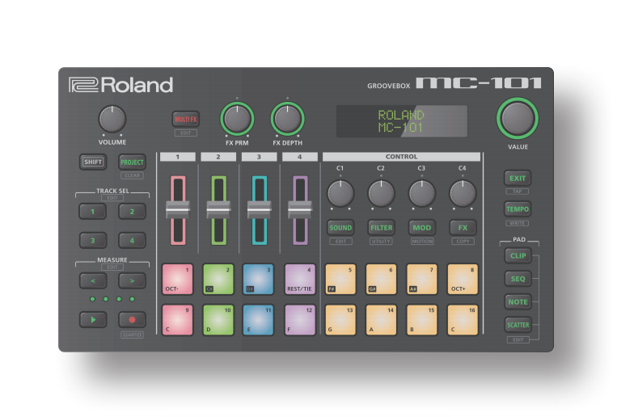

> This is a fork of the [MC 101 cheatsheet](https://github.com/NLxAROSA/mc101cheatsheet) that is no longer maintained. Thanks to NLxAROSA for creating this and encouraging others to continue updating it.

# Cheat Sheet - Roland MC-101 Groovebox

#### Reference detail
> 💽 This document currently references firmware version **==1.82==**.

> It is also strongly recommended that users refer to Roland's [original documentation](https://www.roland.com/global/support/by_product/mc-101/owners_manuals/).
> - In particular the [**MC-101 update manual**](https://static.roland.com/assets/media/pdf/MC-101_update_eng08_W.pdf) that explains newer features that have been added in firmware version 1.8.

Hi there, and welcome to the unofficial Cheat Sheet for the [Roland MC-101 Groovebox](https://www.roland.com/global/products/mc-101/)! 

This Sheet aims to provide a one or two pager of the most useful shortcuts and workflow operations of this nifty little Groovebox. Please note that you'll be able to find *most* of these by reading the manuals, but who has time to go through all of that, right? ;)

## How to read this cheat sheet

- Everything in **bold** refers to a control (a button, knob or slider) on the front panel of the MC-101 (see picture above). Text in *italics* refers to secondary labels (i.e. "*Utility*" on the MC101.
    - The "**Note**" button, used to switch between **note**, **sequence**, **clip**, and **scatter** modes) will be bold. A `note` pad will be indicated in monospace.
- A **+** (**plus-sign**) between two or more controls indicates that those controls should be used simultaneously, in the specified order. 
- A **,** (**comma**) between two or more controls indicates that those controls should be used sequentially, in the specified order.
- The **Measure Select** buttons are indicated with **<** and **>**
- "Multi FX" is condensed to "**MFX**"

#### Menu Navigation
- Menu Navigation steps assume you know how to use the encoder to select menu items. Navigating menues and submenues are indicated with "**→**" indicating navigating 'down' the menu tree.
- Parameters are indicated in monospace font. Like this: `Delay Send`

## Completeness and correctness
This is a work-in-progress (WIP) until specified differently. You're currently looking at the Markdown version of the cheat sheet, the PDF version can be found [here](mc101-cheatsheet.pdf).

Though I always strive to be complete and correct, there's always the chance that there's something missing or just plain wrong in here. Should that be the case then make good use of the [New Issue](https://github.com/NLxAROSA/mc101cheatsheet/issues/new/choose) button from the [Issues](https://github.com/NLxAROSA/mc101cheatsheet/issues) tab above. Or even better: [New Pull Request](https://github.com/NLxAROSA/mc101cheatsheet/compare) from the [Pull Requests](https://github.com/NLxAROSA/mc101cheatsheet/pulls) tab! 

Anyway, enough chitchat, see below for the Cheat Sheet!

# Cheat Sheet - Shortcuts

## 🌐 Global shortcuts

|Action|Shortcut|
|-----------------------------------|-----------------------------------|
|Track settings|**Shift**+**Track Sel**|
|Clip settings|**Shift**+**Clip**|
|Sound settings (*Edit*)|**Shift**+**Sound**|
|*System* menu|**Shift**+**Filter**|
|*Motion* editor|**Shift**+**Mod**|
|*Copy* clip/track|**Shift**+**FX**|
|*Clear* clip|**Shift**+**Project**+**Track Sel**|
|Quick write(save) project|**Shift**+**Tempo**|
|Undo\*\*|**Exit**+ **<** |
| Redo\*\*|**Exit**+ **>** |
|Scatter settings|**Shift**+**Scatter**|
|Quantize settings|**Shift**+**Record**|
|Multi FX settings|**Shift**+**Multi FX**|
|Display knob value & change knob position without changing parameter\*|**Shift**+**Knob**|
|Knob fine adjustment|**Sound/Filter/Mod/FX**+**Value Knob**|
|Select C1 parameter|**Sound**+**C1**|
|Select C2 parameter|**Filter**+**C2**|
|Select C3 parameter|**Mod**+**C3**|
|Select C4 parameter|**FX**+**C4**|
|Storage mode|**Project**+power on device|
|Enter scene mode|**Clip**+**Seq** (or hold **Seq**|

>\* Holding **shift** while turning a control knob does not change the 'value' of the assigned parameter. This can allow you to 'reset' a knob position without altering the current track associated with that control knob.
>\*\* As of Firmware **1.8**

## 🎼 Sequence editing shortcuts

|Action|Shortcut|
|-----------------------------------|-----------------------------------|
|Copy/Paste Step|Select **Pad** to copy, *Copy*, Select **Pad** to paste, *Copy*|
|Delete Step|**Shift**+**Project**+**Pad**|
|Pad edit|**Shift**+Note|
|Duplicate measure|**Seq**+**>**|
|Halve measure|**Seq**+**<**|
|Add drum substep|**Seq**+**Pad**|
|Add low velocity drum hit|**Track Sel**+**Pad**|
|Clear clip|**Shift**+**Project**+**Clip**|
|Edit measure length|**Shift**+**>** or **Shift**+**<**|
|Auto-advance mode (tone track only)|**Pad**, **Record** + **Pad** of 1st step|
|Note edit|**Seq**, **Pad**, **C1**-**C4** to change values|
|Note edit alternative|**Seq**, **Pad**, hold **Sound** or **Filter** or **Mod** or **FX**, **Value** to change value.|
|First/last step mode|**Shift**+**Seq**|
|Cancel first/last step|**Shit**+**Project** while in first/last step mode|
|Toggle notes/chords|Press twice **Note**|
|Chord designer|In chord mode, press **Shift**+**Filter**|

## ▶️ Playback shortcuts

|Action|Shortcut|
|-----------------------------------|-----------------------------------|
|Force start|**Shift**+**Play**|
|Mute/Unmute drum part|**Note**+**Pad** (for clip) or **Track Sel**+**Pad** (for track)|
|Transpose tone track|**Note**+**Pad**|
|Select pitch of looper track|**Note**+**Pad**|
|Random sequence|**Track Sel**+**>**|
|Reverse sequence|**Track Sel**+**<**|
|Tap tempo|**Shift**+**Exit**|
|Toggle metronome|**Tempo**+**Exit**|
|Toggle arpeggiator|Long press **Note**|
|Stutter/top of pattern|**Shift**+**Play** while playing|
|Start/Stop current clip|**Clip**+**Sel** while playing|
|Multi FX parameter select|**Multi FX**+**FX Prim**|
|Multi FX parameter depth|**Multi FX**+**FX Depth**|
|View knob value|**Shift**+**C1**-**C4**|

## Scene shortcuts

|Action|Shortcut|
|-----------------------------------|-----------------------------------|
|Store Scene|**Clip**+**Pad1**-**Pad8**|
|Recall Scene|**Clip**+ long press **Pad1**-**Pad8**|
|Scene selection|Long press **Clip**|
|Scene chain|**Shift**+**Pad**|

# Cheat Sheet - Workflows

## Step recording 
### tone track

Start editing: Press **Seq**, then **Pad** to select the first step, then **Note**. Enable/disable notes via **Pad** (hold for tie). Select step via **Value**.

### drum track:

Start editing: Press **Note**,**Pad** to select the drum part to edit, then **Seq**. Enable/disable steps for given drum part. Select drum part via **Value**.

First/Last Step mode:
    Select last step: **Pad**
    Select first step: **Shift**+**Pad**

## Realtime recording motion to a track

Make sure motion is on (via Motion Editor), Press **Play**, **Record**, press **Sound** or **Filter** or **Mod** or **FX**, **C1**-**C4** to record motion for each track. Press **Record** again to stop.

## Editing motion for a step

Press **Seq**, **Shift**+< or **Shift**+> to select step. Press **Value**, **C1**-**C4** to change motion value.
